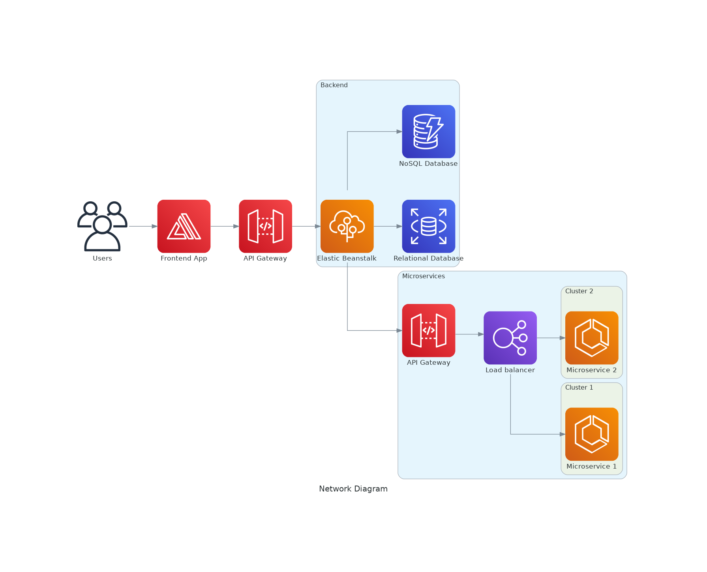

# Diagrama de Red

Produzca un diagrama de red (puede utilizar lucidchart) de una aplicación web en GCP o AWS y escriba una descripción de texto de 1/2 a 1 página de sus elecciones y arquitectura.

El diseño debe soportar:
- Cargas variables
- Contar con HA (alta disponibilidad)
- Frontend en Js
- Backend con una base de datos relacional y una no relacional
- La aplicación backend consume 2 microservicios externos

El diagrama debe hacer un mejor uso de las soluciones distribuidas.

# Solución

Para la solución de este apartado, se eligió deployar el sistema en AWS.

El frontend se decidió deployarlo en Amplify, dado que se encontró que era un servicio específico de AWS para esto. No se llegó a ver la diferencia entre esto y correrlo, por ejemplo, en una instancia de App Runner, pero se eligió por sobre este por ser una solución pensada específicamente para frontend. Se eligió frente a hostear el front en EC2 principalmente por una cuestión de facilidad de uso/configuración, aunque se entiende que tiene ciertas limitaciones y que probablemente sea más caro que esta opción.

Luego, este front se conectaría, mediante el API Gateway, al backend. Para la app en sí se eligió Elastic Beanstalk ya que se encarga automáticamente del escalado y la provisión de recursos (en este caso podría haber sido elegido App Runner también, se eligió esta opción porque es lo que más se repetía en las búsquedas de Google que se realizaron). El mismo se conectó a DynamoDB para la base NoSQL y a RDS para la SQL. A su ves este se conecta a los dos microservicios externos, se asume, mediante otro API Gateway. Los microservicios en sí fueron representados como clusters de EC2, aunque esto no es tan importante para el gráfico, ya que los mismos son externos

En sí, siempre se buscaron servicios que cumplieran con los requerimientos no funcionales automáticamente por una cuestión de falta de familiaridad con todo el abanico de servicios de AWS.

El diagrama final se puede observar a continuación:

# Posibles mejoras

- Al frontend se le podría agregar [Sentry](https://sentry.io/welcome/) y [PostHog](https://posthog.com/) para monitoreo y analytics respectivamente.
- Al back se le podría agregar Graphana, Prometheus, etc para monitoreo/logging.
- Se usó [Diagrams](https://diagrams.mingrammer.com/) bajo la hipótesis de que tener el diagrama en código sería útil/cómodo. Hasta cierto punto lo fue, pero el módulo deja mucho que desear. Se podría rehacer el diagrama en lucidchart y emprolijar un poco.
